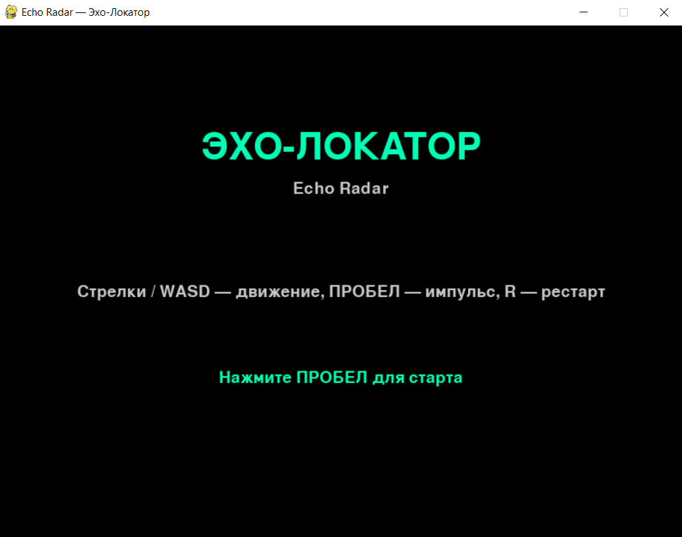
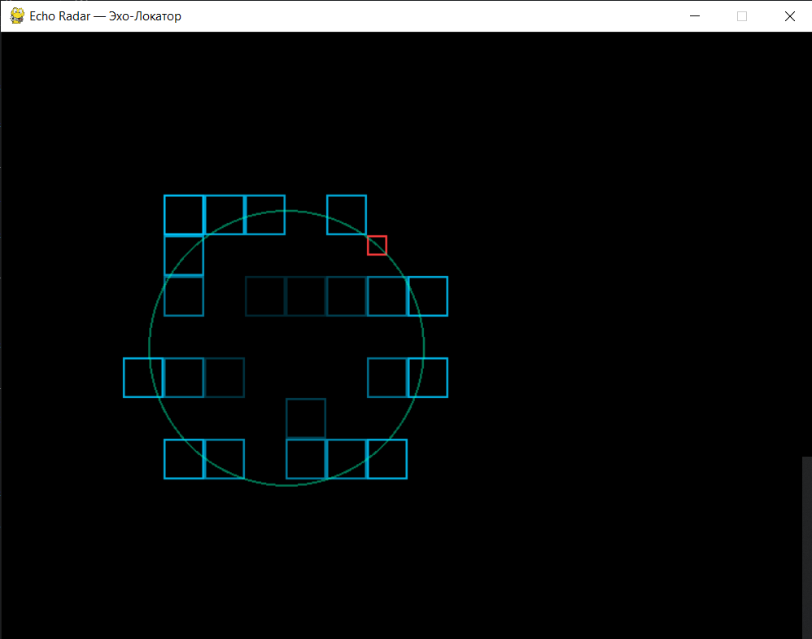
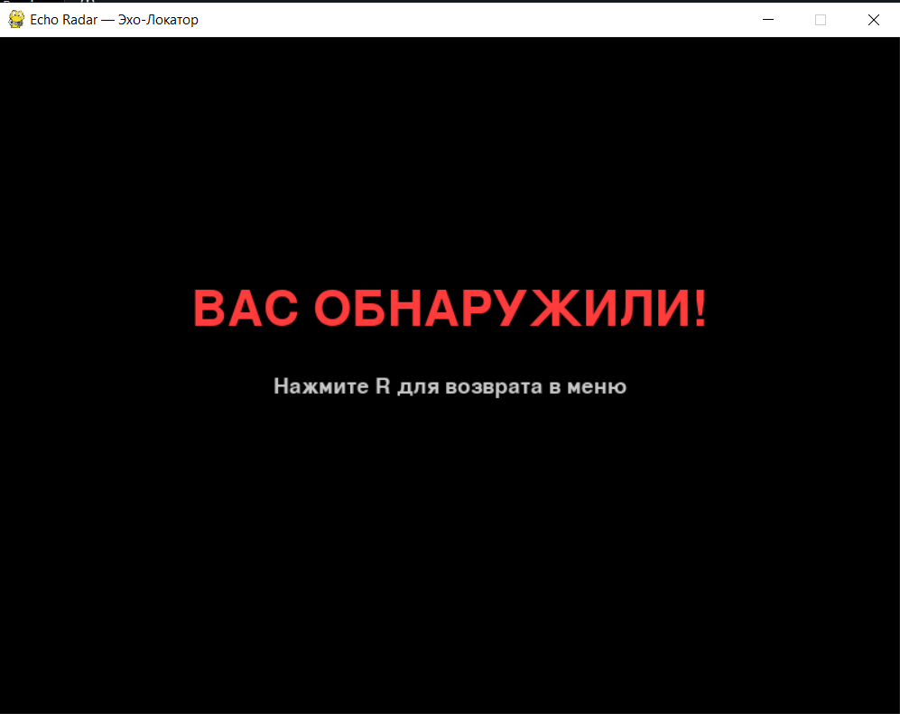
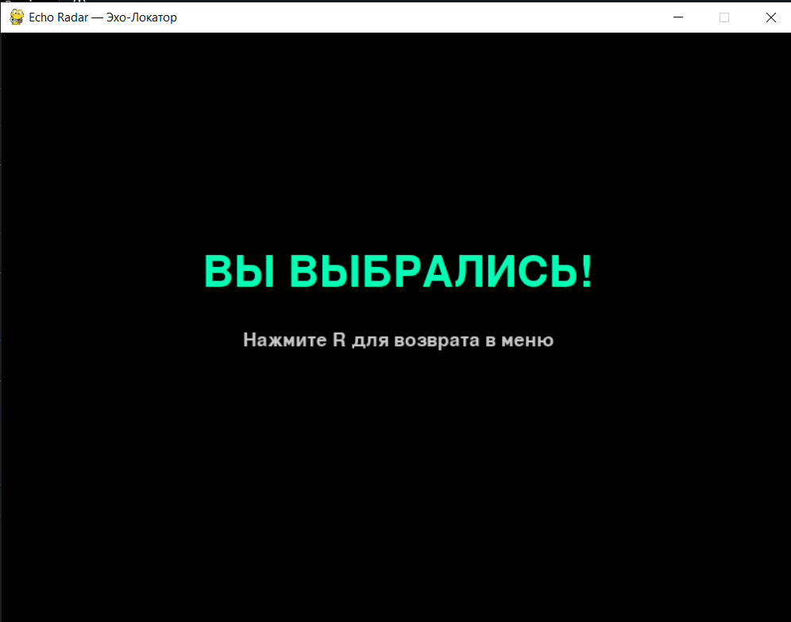

# Echo Radar
## «Эхо-Локатор» (EchoRadar)

Echo Radar — это 2D-игра с механикой эхолокации.

Экран полностью чёрный. Игрок управляет невидимой точкой, которая движется по лабиринту. Нажатие пробела испускает круговую звуковую волну: она расширяется от игрока и на пару секунд подсвечивает контуры стен и врагов, после чего они снова гаснут. Цель — найти выход из лабиринта и не наткнуться на врагов.

---

## Стек технологий

- **Python 3.12**
- **Pygame 2.6.1** — графический движок, обработка ввода и отрисовка

---

## Структура проекта

```
echo_radar/
├── main.py           # Точка входа в приложение
├── constants.py      # Все общие константы: размеры, цвета, уровень, состояния
├── game.py           # Основной игровой цикл и логика игры
├── level.py          # Построение стен лабиринта и их отрисовка
├── sound_wave.py     # Класс звуковой волны
├── player.py         # Класс невидимого игрока
├── enemy.py          # Класс врага
└── ui.py             # Интерфейс: меню и финальный экран
```

### Назначение модулей

| Модуль | Назначение |
|--------|-----------|
| `constants.py` | Все числовые параметры, цвета, матрица уровня, тексты |
| `game.py` | Игровой цикл, обработка ввода, обновление объектов, отрисовка |
| `level.py` | Построение `pygame.Rect` из матрицы, отрисовка стен с подсветкой |
| `sound_wave.py` | Звуковая волна: расширение, подсветка, затухание, отрисовка |
| `player.py` | Невидимый игрок: движение, коллизии |
| `enemy.py` | Враг: хранение позиции и яркости, отрисовка при подсветке |
| `ui.py` | Меню, экран завершения (победа / поражение) |

---

## Запуск игры

Запуск из папки проекта:

```bash
cd echo_radar
python main.py
```

---

## Управление

| Клавиша | Действие |
|---------|----------|
| `↑` `↓` `←` `→` или `W` `A` `S` `D` | Перемещение невидимого игрока |
| `ПРОБЕЛ` | Испустить звуковую волну |
| `R` | Возврат в меню (после завершения игры) |
| `Закрыть окно` | Выход из игры |

---

## Механики игры

### 1. Невидимость

- Экран полностью чёрный.
- Игрок не отрисовывается — он существует только как `pygame.Rect` для проверки коллизий.
- Все объекты (стены, враги) тоже невидимы, пока их не подсветит волна.

### 2. Звуковая волна

- Нажатие пробела создаёт волну в центре игрока с радиусом `R = 0`.
- Каждый кадр радиус увеличивается на `WAVE_SPEED = 4` пикселя.
- Стена или враг подсвечивается, если расстояние от центра волны попадает в диапазон `R ± WAVE_THICKNESS`.
- Подсвеченный объект получает `alpha = 255` (максимальная яркость).
- Каждый кадр `alpha` уменьшается на `ALPHA_DECAY = 8` — плавное затухание до полной темноты.
- Волна перестаёт расширяться при `radius >= WAVE_MAX_RADIUS`, но «дотлевает» ещё 40 кадров, чтобы затухание успело погасить последние подсвеченные объекты.

### 3. Враги

- Враги неподвижны.
- Видны только при подсветке волной (как и стены).
- При столкновении игрока с врагом — поражение.

### 4. Условия победы и поражения

| Исход | Условие |
|-------|---------|
| **Победа** | Игрок вышел за пределы окна через проём в стене |
| **Поражение** | Игрок столкнулся с врагом |

---

## Интерфейс

### Стартовый экран
- Заголовок «ЭХО-ЛОКАТОР»
- Подзаголовок «Echo Radar»
- Подсказка с управлением
- «Нажмите ПРОБЕЛ для старта»

### Игровой экран
- Полностью чёрный фон
- Подсвеченные стены — голубые контуры
- Подсвеченные враги — красные контуры
- Волна — расширяющийся полупрозрачный круг

### Финальный экран
- `ВЫ ВЫБРАЛИСЬ!` (зелёный) — игрок нашёл выход
- `ВАС ОБНАРУЖИЛИ!` (красный) — игрок врезался во врага
- Подсказка «Нажмите R для возврата в меню»

---

## Конфигурация

Основные параметры игры хранятся в `constants.py`:

```python
WAVE_SPEED = 4.0            # скорость расширения волны (пикселей/кадр)
WAVE_MAX_RADIUS = 250       # максимальный радиус волны
WAVE_THICKNESS = 5          # толщина кольца подсветки
ALPHA_DECAY = 8             # шаг затухания яркости за кадр
PLAYER_SPEED = 3            # скорость игрока
```

Матрица лабиринта задаётся в `constants.py`:

```python
LEVEL_MATRIX = [
    [1, 1, 1, ...],  # 2 = выход, 1 = стена, 0 = пусто
    [1, 0, 0, ...],
    ...
]
```

Стартовые позиции игрока и врагов:

```python
PLAYER_START = (60, 60)
ENEMY_POSITIONS = [(360, 200), (600, 440), (240, 440), (680, 120)]
```

---


## Скриншоты

### Стартовый экран



Заголовок, управление и подсказка для старта.

### Игровой процесс



Волна от пробела подсвечивает стены лабиринта.

### Поражение



Экран проигрыша при столкновении с врагом.

### Победа



Победный экран побеге из лабиринта.

---

## Зависимости

Убедитесь, что установлен Python 3.12+ и Pygame 2.6.1:

```bash
python3 -c "import pygame; print(pygame.__version__)"
```

Если Pygame не установлен:

```bash
pip install pygame
```
